# Milestone-project-1
This is the first milestone project for Runshaw College and Code Institute.
## 1. Purpose of the project
Hi! This is my portfolio website. I created a simple site about my skillsets and work experiences, so potential future employers can check my CV, and see how I improved my skills, and knowledge about web development. In the first part, I want to introduce my personality and tell a little bit about myself. The next part is about my work history. Here I made 5 categories, and visitors can check them in more detail if they are interested. The third part is about my programming skills, how well I know the different programming languages, frameworks, and any other soft skills, that are important in a job, and I learned them while working in other industries. After this, I have a contact form, and at the bottom of the page, people can download my CV in PDF or contact me on social media.
### 1.2. Developer and business goals
As a developer, I wanted to create a user-friendly website, so I tried to use more graphic elements than text, but something, that still explains my message, and is engaging. Also, this message should be well organized and readable in different screen sizes. So, if the content was too long, I broke it up into smaller pieces, which is easier to digest. This is a single-page design, which I think is more modern. People can just scroll down if they want to read more. My webpage doesn't contain too much information, and recruiters can read it on mobile devices as well.
## 2. User stories
As a visitor, I want learn about Katalin as a candidate for a job. I want to see her work history. I want to see her skillsets. I want to check her portfolio, and contact her for future job opportunities. I want to check her social media as well.
## 3. Features
### 3.1. Existing features
  * Easy to use navigation bar. It is in a fixed position on the top of the website. 

  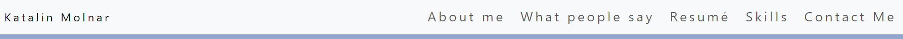

  * I picture of me and some introduction text with a quote, so people can learn more about me.

  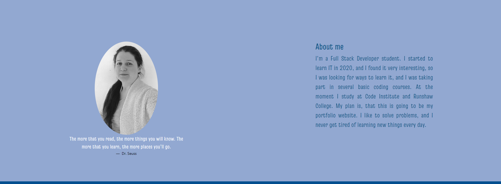

  * The next one is the review section when people speak about my work.

  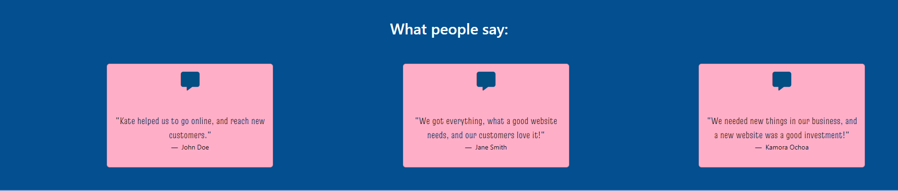

  * In the Resume section I categorized my job experiences, so people can open and read only small parts of my resume. 

  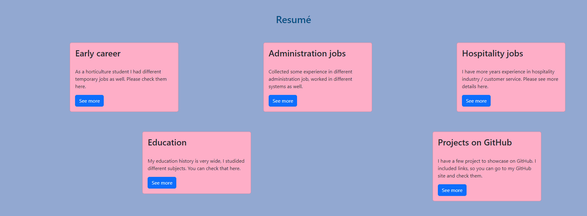

  If they click on See more, a model opens for them.

  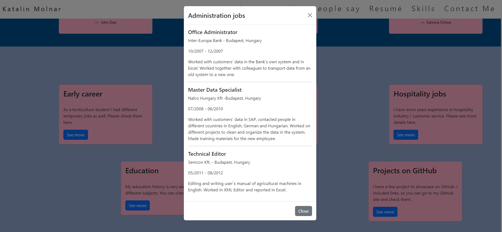

  * I made a list of my skills in the skills section with colourful graphics.

  

  * I included a Contact form to fill in, and people can email me if they have an idea of a project or want to ask me anything. 

  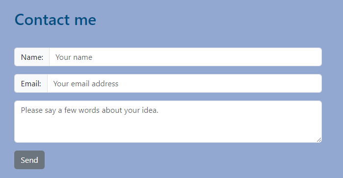

  * Downloadable CV, if anybody needs my CV in pdf format. 

  

  * Links to my social media sites, which open in separate tabs. 

  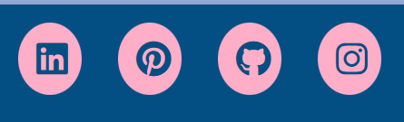
## 4.  Future features
* I was thinking of connecting my GitHub projects to this site, so that future employers can check them out here, and they don't need to go to GitHub.  
## 5. Typography and color scheme
* I used Lato and Truculenta from fonts.google.com. These fonts are easy to read on various device screens.
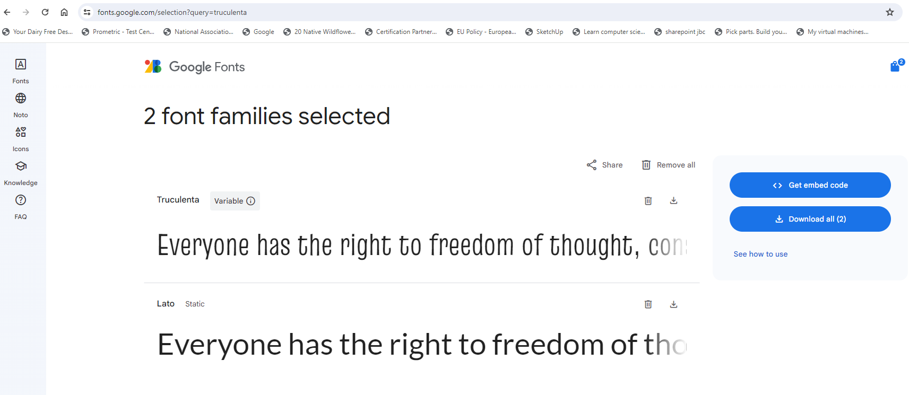
* I used blue (`#034f84` and `#92a8d1`), grey(`#6C757D`), pink (`#ffaec8`) white (`#ffffff`), and black (`#000000`) colour palette for this project. This colour combination has a sense of tranquillity effect on readers. 
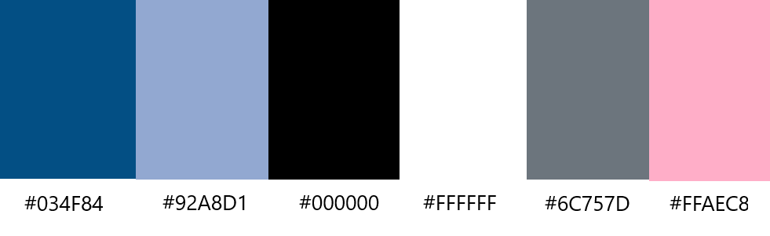
* I didn't use too many media elements, only my profile picture. This is a black-and-white picture, and it blends well with the colour palette. 
* For accessibility, I used a colour contrast checker from the web for this <https://coolors.co/contrast-checker/112a46-acc8e5>. I made sure the layout follows the HTML hierarchy. I used easy to read fonts. I added explanation texts or symbols, where I used interactive elements. I used alternative text for my image. Keyboard navigation is easy on my website. 
* I tried to use lots of graphic elements, so users don't need to read everything. I tried to use different colours as well, so people could be engaged more with the website. 
## 6. Wireframes
I used Balsamiq to create my wireframe, which you can check here [Link to the wireframe](/Milestone-project1.pdf). There are wireframes for 3 different screen sizes (desktop computer, tablet, phone), and my project contains more sections, so people can scroll down to read them. I modified my wireframe a couple of times; this is the latest version. This wireframe helped me to position things and organize my content.
## 7. Technologies used
* I used HTML to create the layout, the basic structure for the website. 
* CSS to style the website.
* Bootstrap to speed up the developing process and help with the accessibility and responsibility. Bootstrap and CSS media queries ensure, that the layout changes appropriately across different device screen sizes.
* I used Balsamiq for my wireframe, so I could think about the structure of my website, size the features, and see how thinks can work/function. 
* I used git for version control.
* I used GitHub to save my repository and deploy my project online.
## 8. Testing
I was running several tests to see if my website has no errors and is accessible to different users.
### 8.1. Code validation
I used the official W3C validator for testing HTML, and there were no errors.
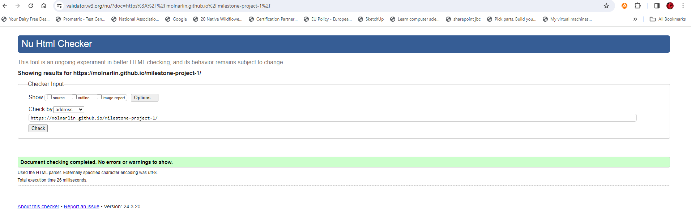
* Official (jigsaw) validator for testing CSS, and there were no errors in my code.
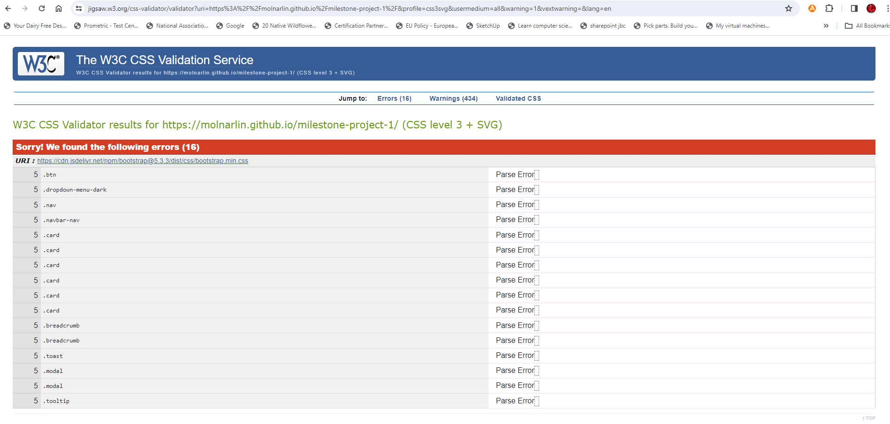
* Lighthouse report in Google Chrome. I checked the accessibility, perfomance, best practices here. 
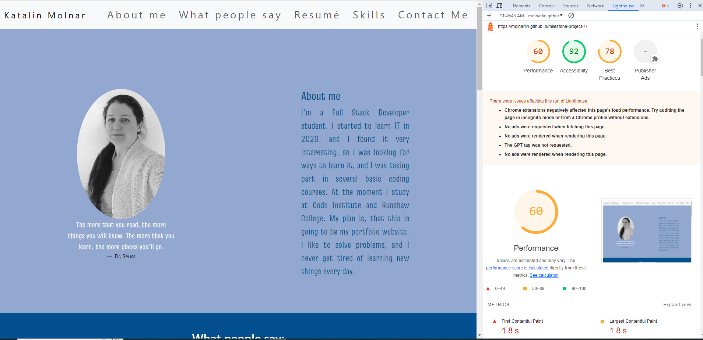
### 8.2. Test cases
* On desktop computer the screen is very wide, so contents are mainly next to eachother, and everything is still readable.
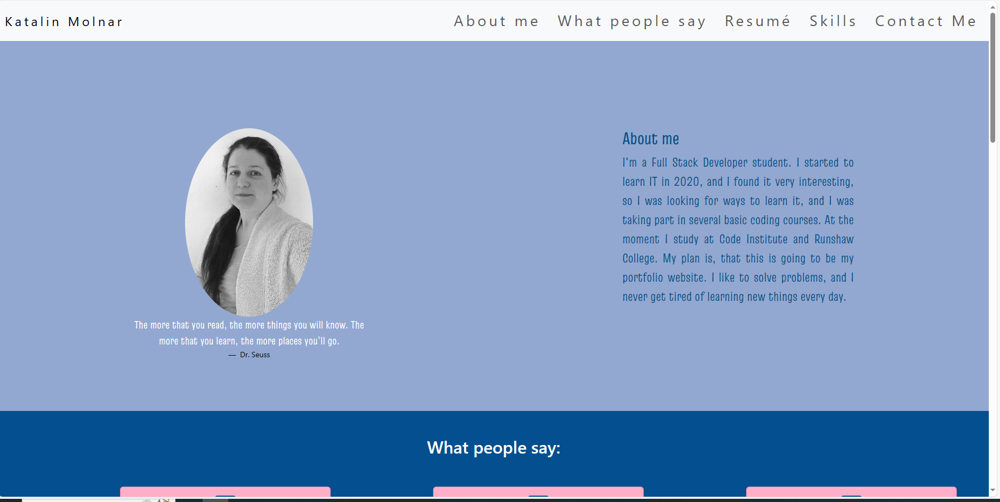
* On tablets there is a bit less space, but some content can be next to eachother. I started to use the burger menu for the navigation bar.
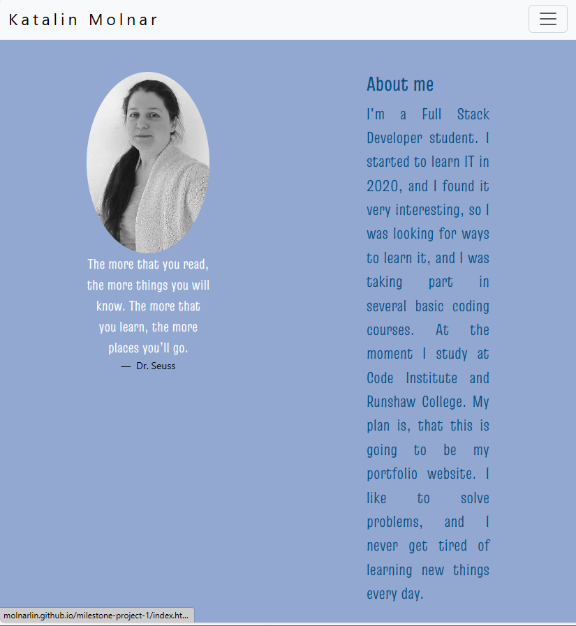
* On phone there is little space, so I moved most of the contents underneath eachother.
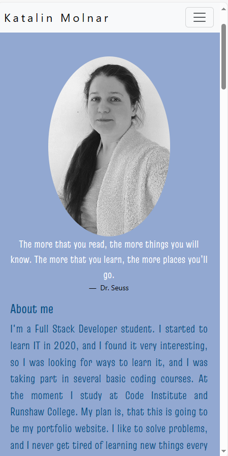
### 8.3. Fixed bugs
I came across couple of bugs, and I give a short explanation, how I fixed them here.
* Card elements wasn't responsible. When I copied the from Bootsrap, cards had fixed width.
```HTML
<div class="card" style="width: 18rem;">
  
  <div class="card-body">
    <h5 class="card-title">Card title</h5>
    <p class="card-text">Some quick example text to build on the card title and make up the bulk of the card's content.</p>
    <a href="#" class="btn btn-primary">Go somewhere</a>
  </div>
</div>
```
So I customized them with CSS, so they don't overlap on different screen sizes:
```CSS
.card{
	width: 95%;
  height: 15rem;
  margin:auto 5%;
}
``` 
* Navigation bar was in fixed position, but when I scrolled down, it was under other elements.
```HTML
<nav class="navbar navbar-expand-lg navbar-light bg-light position-fixed">
  <button class="navbar-toggler" type="button" data-toggle="collapse" data-target="#navbarTogglerDemo01" aria-controls="navbarTogglerDemo01" aria-expanded="false" aria-label="Toggle navigation">
    <span class="navbar-toggler-icon"></span>
  </button>
  <div class="collapse navbar-collapse" id="navbarTogglerDemo01">
    <a class="navbar-brand" href="#">Hidden brand</a>
    <ul class="navbar-nav mr-auto mt-2 mt-lg-0">
      <li class="nav-item active">
        <a class="nav-link" href="#">Home <span class="sr-only">(current)</span></a>
      </li>
      ...
  </div>
</nav>
```
I had to add sticky-top class, and this bug was fixed as well.
```HTML
<nav class="navbar navbar-expand-xl bg-body-tertiary py-2 w-100 border-0 rounded-0 fs-3 position-fixed sticky-top">
```
* Different inline elements were overlaping on small screens, so I moved them underneath eachother.
I had problem with the cards, so I used col and offset classes from Bootstrap for different screen sizes, see an example below:
```HTML
<div class="d-sm-block col-lg-3 offset-lg-1 pt-5">
```
### 8.4. Supported screens and browsers
I used Google Chrome to check my website on different screen sizes. I tried to increase and decrease the size and made changes regarding that. Toggle device toolbar in Inspect mode was very helpful.
Bootstrap support most of the browsers on different devices, so it helped me to make my website more accessible. If you want to read more about this, [click here](https://getbootstrap.com/docs/4.0/getting-started/browsers-devices/#:~:text=Browsers%20and%20devices%201%20Supported%20browsers%20Bootstrap%20supports,7%20Android%20stock%20browser%20...%208%20Validators%20).
## 9. Deployment
### 9.1. via VS Code
1. I created a folder for my project on the computer.
2. I opened and created folders, files in this with the help of Visual Studio Code. 
3. I saved all of the changes. 
4. I could deploy the index.html file localy from this folder.
### 9.2. via GitHub Pages
1. I connected Visual Studio Code with my GitHub account. 
2. I commited and pushed all of my new code regularly to GitHub. 
3. Inside the milestone-project-1 repository I went to Settings > Pages, and I deployed from the main branch.
4. When my site was live, I could visit it from here. 
## 10. Credits
* I have to say a big thank you to Runshaw College and Code Institute for guiding me and helping me with this project.
* I used w3schools.com, fonts.google.com, and getbootstrap.com as a library. I downloaded my own CV from Indeed.com.
* I used stackoverflow.com to check some issues with my website.


[def]: /assets/images/readme_images/intro.png
