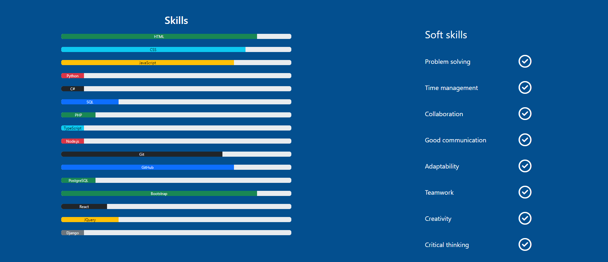

# milestone-project-1
This is the first milestone project for Runshaw College and Code Institute.
## 1. UX
### Project goals
Hi! This is my portfolio website. I created a simple site about my skillsets and work experiences, so potential future employers can check my CV, and see how I improved my skills, and knowledge about web development. In the first part I want to introduce my personality and tell a littlebit about myself. The next part is about my work history. Here I made 5 categories, and visitors can check them in more details if they are interested. The third page is about my programming skills, how well I know the different programming languages, frameworks, and any other soft skills, that are important in a job, and learned them while working in other industries. 
### Developer and business goals
As a developer, I wanted to create a user-friendly website, so I tried to use more graphic elements than text, but something, that still explains my message, and is engaging. Also, this message should be well organized and checked in different screen sizes. So if the content was too long, I was breaking it up into smaller pieces, which is easier to digest.
### User stories
As a users I can easily navigate through the different webpages, and learn about Katalin as a candidate for a job. I can use the main navigation menu and a layout helps me to read trough and find information about Katalin. There are many graphics elements to find the way to the contents. 
### Design choices
This is a User Centric Frontend Development project. Used semantic markup to structure HTML code. The code is split into readable, separated lines, and I included comments in main sections. I used Bootstrap in the design, which has lots of pre-written code, so speeds up the process, gives ideas to the layout, compatible with the browsers, and it is easy to make a responsive design with it.
* I used Lato and Truculenta from fonts.google.com.
* I used blue (`#034f84` and `#92a8d1`), grey(`#6C757D`), pink (`#f33a6a`) white (`#ffffff`) and black(`#000000`) colour palette for this project.

### Wireframes
I used Balsamiq to create my wireframe, which you can check here [Link to the wireframe](/Milestone-project1.pdf). There are wireframes for 3 different screen sizes, and my project contains more sections, so peolpe can scroll down to read them. I modified my wireframe a couple of times, this is the latest version. This wireframe helped me to position things and organize my content.
## 2. Features
### 1. Existing features
  * Easy to use navigation bar. It is in a fixed position on the top of the website. 

  

  * I picture of me and some introduction text with a quote, so people can learn more about me.

  

  * Next one is the review setion, when people speak about my work.

  

  * In the Resume section I categorized my job experiences, so people can open and read only small parts of my resume. 

  

  If they click on See more, a model opens up for them.

  

  * I made a list of my skills in the skills section with colourful graphics.

  

  * I included a Contact form to fill in, and people can email me, if they have an idea of a project or they want to ask me anything. 

  

  * Downloadable CV, if anybody needs my CV in pdf format. 

  

  * Links to my social media sites, which open in separate tabs. 

  
### 2.  Future features
* I was thinking to connect my GitHub projects to this site, so that future employers can check them out here, and they don't need to go to GitHub. 
## 3. Technologies used
I used HTML, CSS, and Bootstrap for this project. Balsamiq for my wireframe. Bootstrap and CSS media queries ensure, that the layout changes appropriately across different device screen sizes.
## 4. Testing
* I used official W3C validator for HTML.
* Official (jigsaw) validator for CSS.
* Accessibility Checker.
* Lighthouse report in Google Chrome.
## 5. Deployment
I deployed the project with GitHub pages.
## 6. Credits
* I have to say a big thank you to Runshaw College and Code Institute for guiding me and helping me with this project.
* I used w3schools.com, fonts.google.com, and getbootstrap.com as a library. 
* Content
* Media
* Code
* Acknowledgement

[def]: /assets/images/readme_images/intro.png